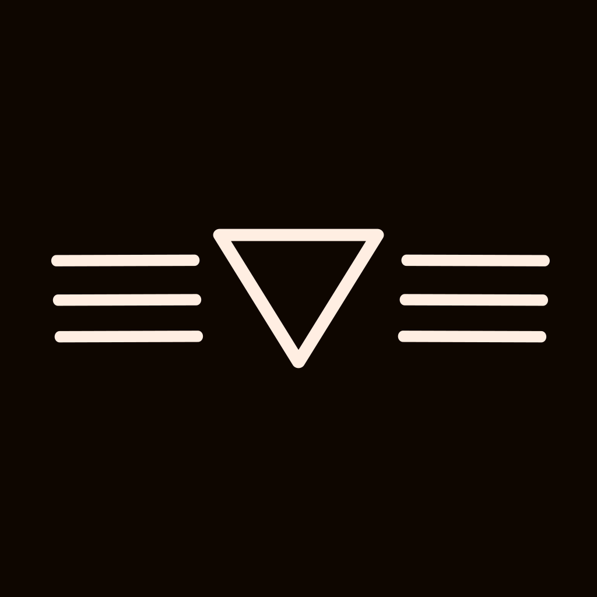
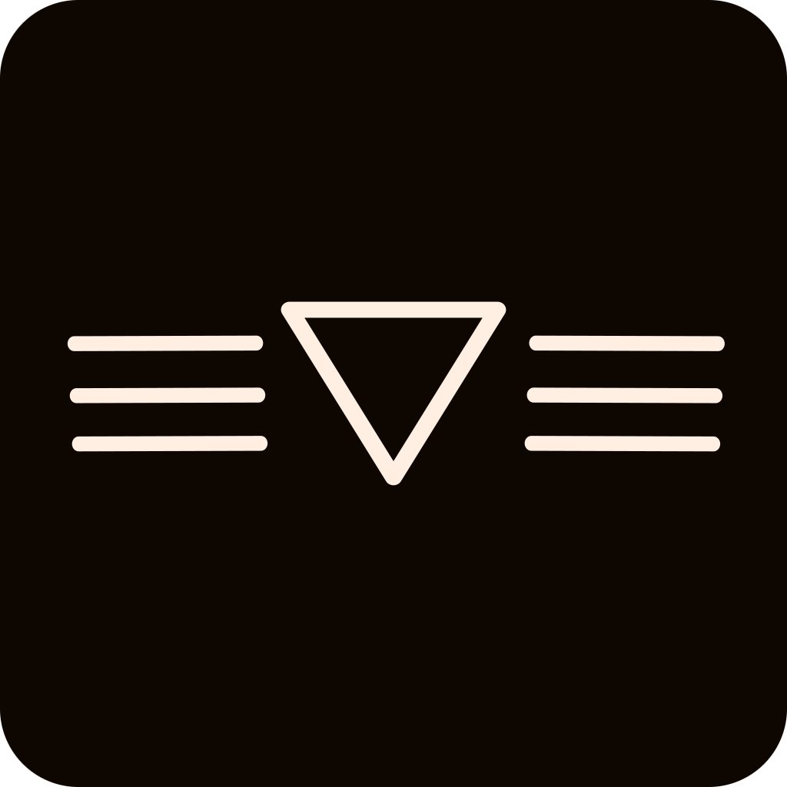
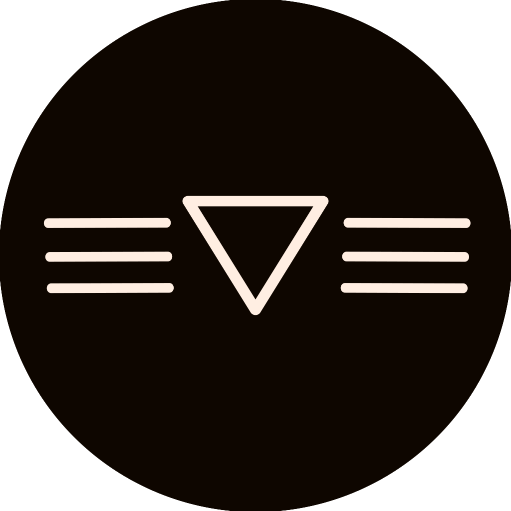
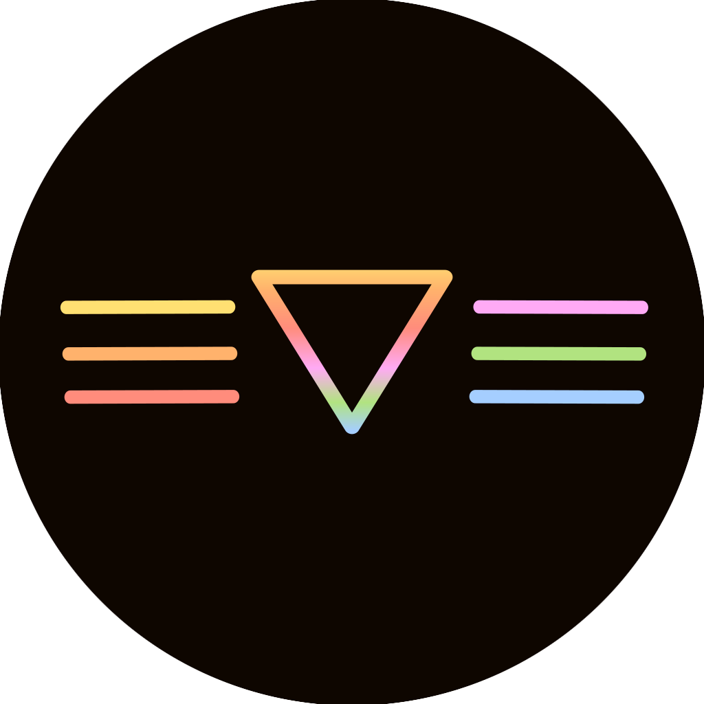
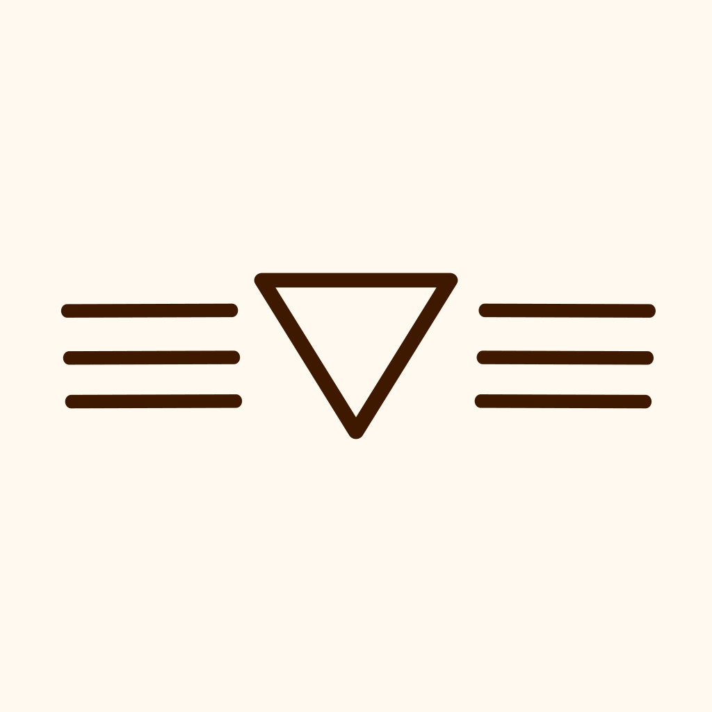
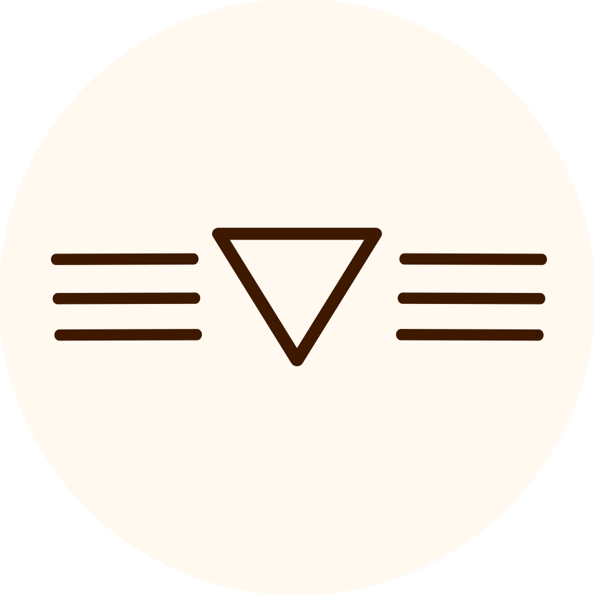
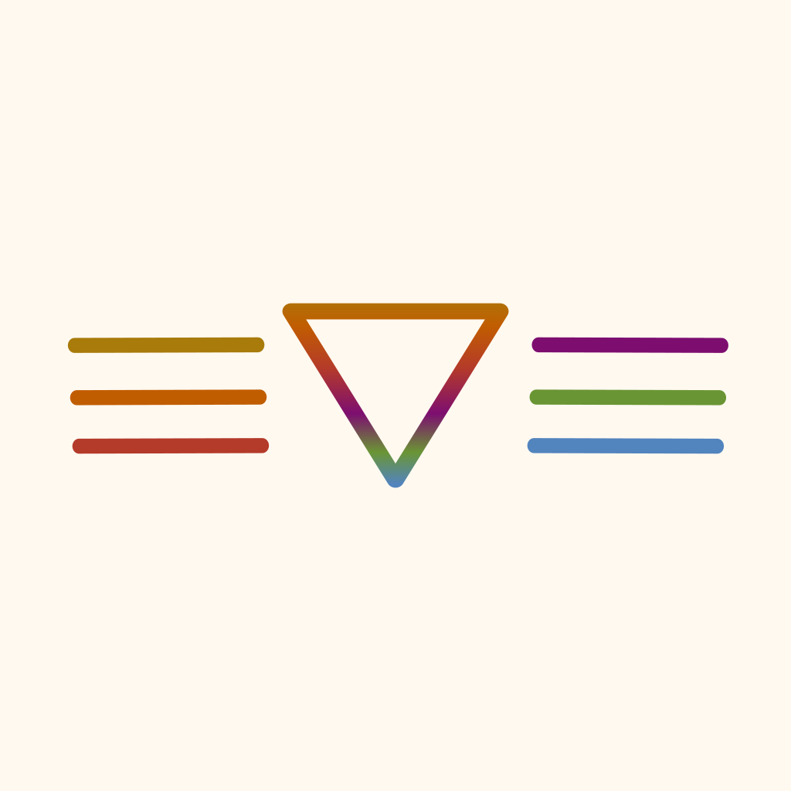
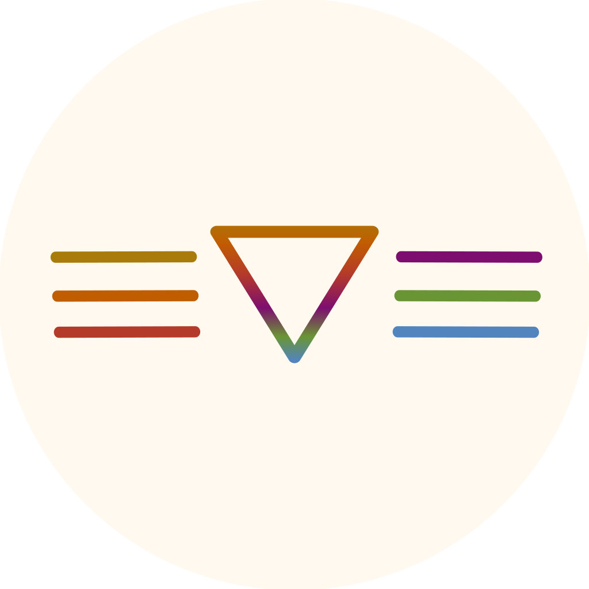

# 🐅 Logos

## Base SVGS
|Base|Panther Color|Tiger Color|
|-|-|-|
||||

## Cover Images
### Panther
#### Base
|Base|Rounded|Round|
|-|-|-|
||||

#### Color
|Base|Rounded|Round|
|-|-|-|
||||

### Tiger
#### Base
|Base|Rounded|Round|
|-|-|-|
||||

#### Color
|Base|Rounded|Round|
|-|-|-|
||||

# 🔎 Previews 
|Panther|Tiger|
|-|-|
|||
